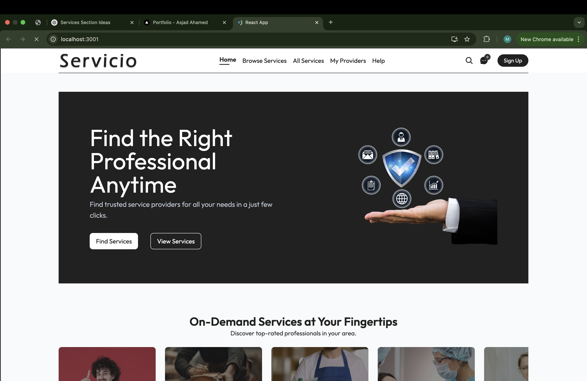

# Servicio - Service Provider App

**Servicio** is a MERN stack full-stack application designed to connect users with service providers. This app allows users to book providers, contact them, and manage their preferences, while providers can manage their availability, showcase their work, and connect with users.

---

## Features

### User Features:
- **Sign Up / Log In**: Users must create an account to use the app.
- **Book Providers**: Users can book and contact service providers.
- **Manage Favorites**: Users can add providers to their favorites for quick access.
- **Edit Profile**: Users can update their profile information.
- **Filter & Search Providers**:
  - Filter by provider categories.
  - Search for providers by name or service.

### Provider Features:
- **Sign Up / Log In**: Providers can create an account to offer their services.
- **Manage Availability**: Providers can update their availability.
- **Showcase Work**: Providers can post their work to attract users.
- **Edit Profile**: Providers can update their profile information.

---

## Tech Stack

### Frontend:
- **React.js**: User interface development.
- **Tailwind CSS**: For styling the website.

### Backend:
- **Node.js**: Server-side runtime environment.
- **Express.js**: Web framework for API development.

### Database:
- **MongoDB**: Database for storing user and provider data.

### Tools:
- **JWT**: Authentication and authorization.
- **Postman**: For API testing.
- **Git & GitHub**: Version control.

---

---

## Future Enhancements

- Add real-time chat between users and providers.
- Implement a review and rating system for providers.
- Introduce notifications for bookings and availability updates.
- Optimize search with advanced filters.

---
